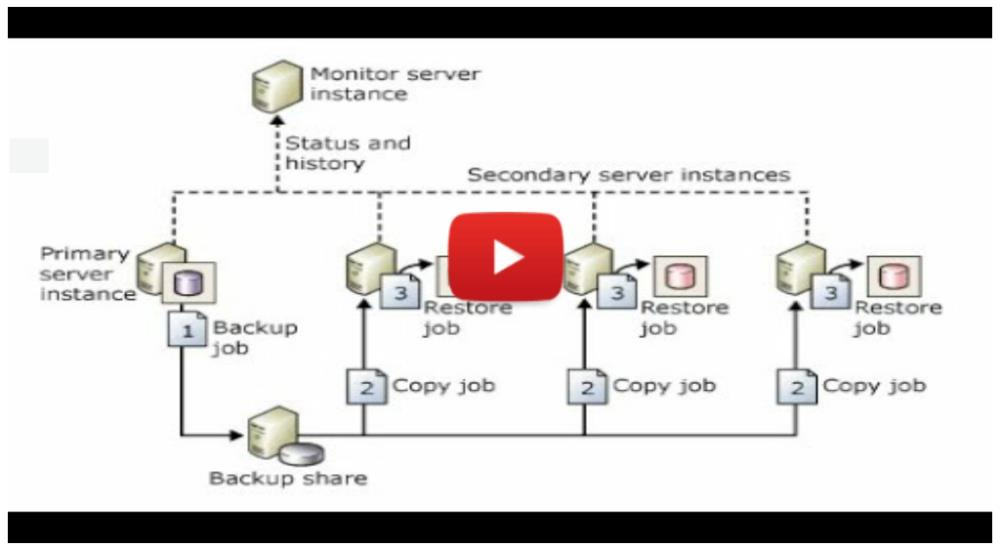

# Custom Log Shipping Script

When it comes to Disaster Recovery Setup, every DBA has its own preference. I personally prefer Log Shipping since it involves very little effort to setup. Log shipping has many benefits as stated below:-

1. Multiple Secondary copies with different delay and uses
2. Can be used as Disaster Recovery Technique
3. Can be used for Limited Reporting Workload
4. Can be used to migrate data to a new location with minimum downtime
5. SQL Server Upgrade
6. No additional load on Primary instance
7. Works well in combination with other HADR features  like Mirroring, AlwaysOn, Clustering etc.

But If you use Domain Account for SQL Services, then Log Shipping using Custom scripts could be established in much easier way than the default log shipping method. For this purpose, I have created by own Log Shipping procedure [dbo].[usp_DBAApplyTLogs]

<b> [Latest Code of [usp_DBAApplyTLogs]](usp_DBAApplyTLogs.sql)</b>

To learn on how to use this script, please watch below YouTube video:-

