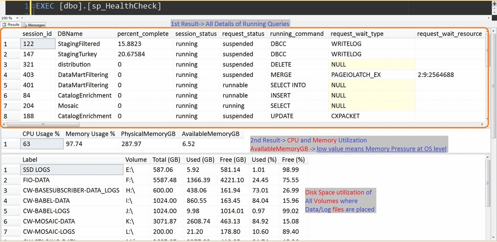

# [sp_HealthCheck]

This project contains a procedure named [sp_HealthCheck](sp_HealthCheck.sql). 

This procedure gives `currently running queries`, `CPU and Memory usage`, `Usage of Data & Log Volumes`, `Space utilization of data/log files`, `Lead Blockers`, and `session details performing Backup/Restore/Rollback`.

